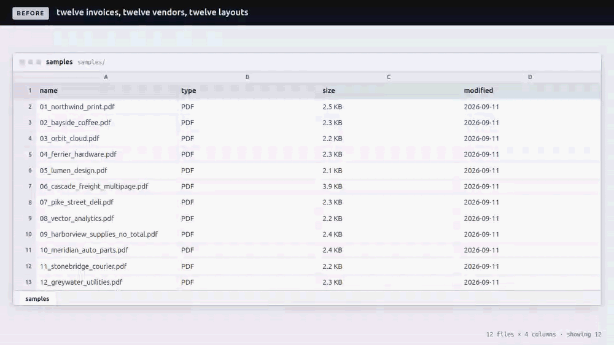

# PDF invoices → clean CSV

Point it at a folder of invoice and receipt PDFs. Get back one CSV you can open
in a spreadsheet, plus a one-line report saying which documents a human should
look at.



Different vendors, different layouts, different date formats. No per-vendor
templates to write and nothing to train.

## What it pulls out

Per document: vendor, invoice number, invoice date (normalised to `YYYY-MM-DD`),
currency, subtotal, tax, total. Per line: description, quantity, unit price,
line total.

A field it cannot find on the page is **left empty and flagged**. It is never
guessed and it never crashes the run.

## Install and run

Needs `make`, `curl` and a 64-bit Linux or macOS. That is the whole list — it
does **not** need you to have Python 3.12, `pip` or `uv` set up first.

```bash
git clone <this repo> && cd pdf-to-csv
make run
```

`make run` creates the virtualenv, installs the dependencies and extracts every
invoice in `samples/` into `invoices.csv`. It prints:

```
12 files, 11 parsed clean, 1 needing review
  review  09_harborview_supplies_no_total.pdf: missing: total
```

```bash
make test           # run the test suite
make demo           # regenerate the clip above, headless
make demo-terminal  # the same story recorded as a terminal session instead
```

The first run bootstraps a pinned [uv](https://astral.sh/uv) into
`demo/.toolchain/` if your machine has none, because a stock Ubuntu 24.04 box
has neither `uv` nor a `python3` with `ensurepip`. Nothing is installed
system-wide and nothing needs root. If you would rather use your own tooling:

```bash
uv venv && uv pip install -e '.[dev]'            # or:
python3 -m venv .venv && .venv/bin/pip install -e '.[dev]'

.venv/bin/python extract.py samples/ -o invoices.csv --report
```

That last line is the whole tool; everything above it is just getting a Python
that can run it.

## What the output looks like

One row per line item, with the invoice-level fields repeated on each row, so it
pivots and imports without reshaping.

```
source_file,vendor,invoice_number,invoice_date,currency,line_no,description,quantity,unit_price,line_total,subtotal,tax,total,needs_review,issues
01_northwind_print.pdf,Northwind Print Co.,INV-2024-0417,2024-03-15,USD,1,"Business cards, 16pt matte, 500ct",4,42.50,170.00,521.00,42.98,563.98,no,
01_northwind_print.pdf,Northwind Print Co.,INV-2024-0417,2024-03-15,USD,2,"Tri-fold brochure, gloss, 250ct",2,138.00,276.00,521.00,42.98,563.98,no,
09_harborview_supplies_no_total.pdf,Harborview Supplies,HV-5521,2024-03-21,,1,"Packing tape, 48mm (case)",5,27.60,138.00,452.50,31.68,,yes,"missing: total"
```

A document with no readable line items still gets exactly one row, so nothing
disappears quietly.

## When it flags a document

`needs_review` is `yes` and the `issues` column says why:

- a required field is missing (`missing: total`);
- the line items do not add up to the printed subtotal;
- subtotal plus tax does not equal the printed total;
- no line items were found at all;
- the date was genuinely ambiguous (`03/04/2024`) and had to be read with the
  `--date-order` setting;
- the PDF has no text layer, or could not be opened at all.

The numbers it writes are always the numbers printed on the page. It reports
disagreements; it does not quietly fix them.

## Options

```
extract.py <input-dir-or-pdf> [-o out.csv] [--report]
                              [--date-order mdy|dmy] [--fail-on-review]
```

| Flag | Effect |
| --- | --- |
| `-o, --output` | CSV file to write. Default is stdout, so it pipes. |
| `--report` | Print `N files, M parsed clean, K needing review`, then one line per flagged document. Goes to stderr when the CSV is going to stdout. |
| `--date-order` | How to read an all-numeric date where both readings are valid, e.g. `03/04/2024`. Default `mdy`. Unambiguous dates such as `15/03/2024` are read correctly either way and are not affected. |
| `--fail-on-review` | Exit 1 if anything needs review. For running in a pipeline. |

Exit codes: `0` fine, `1` something needs review (only with `--fail-on-review`),
`2` bad input path.

## Sample data

`samples/` holds 12 invented invoices, all generated by
`samples/generate_samples.py` — four layouts, five date formats, two currencies,
one that runs to two pages, and one draft with no total on it so the flagging
behaviour is visible. There is no real business or client data anywhere in this
repo.

Regenerate them with `.venv/bin/python samples/generate_samples.py`. That script
also writes `tests/ground_truth.json` from the same values it draws onto the
page, which is what the end-to-end tests assert against.

## Limits, honestly

- **Text-layer PDFs only. Scans and photos are out of scope.** A scanned page
  has no text to read, so it is reported as
  `no text layer (looks like a scan; OCR is out of scope)` rather than returning
  empty fields. Adding OCR means Tesseract or a paid API, a preprocessing step
  per page, and roughly a second per page instead of milliseconds — a different
  tool with a different accuracy conversation, not a flag on this one.
- **Line items are read from the text layer, not from ruled cells.** A row is
  accepted only when `quantity × unit price` matches the line total, which is
  what keeps headings and addresses out of the table. A layout that prints a
  quantity but no unit price will not produce line items, and the document gets
  flagged.
- **Vendor is read as printed.** A receipt that prints its name in capitals
  comes out in capitals; the original casing is not in the file.
- **One invoice per file.** Several invoices concatenated into one PDF are read
  as a single document.
- **Currency is detected from a symbol or an ISO code**, and is left empty if
  the document prints neither.
- Tested against the 12 documents in `samples/`, four layouts between them. Real
  vendor layouts vary more; the honest expectation on a new set is that most
  parse clean and the rest get flagged rather than silently wrong. That is the
  behaviour the flag exists for.

## Tests

```bash
make test          # or: .venv/bin/python -m pytest -q
```

253 tests, plus 4 that skip without `openpyxl`. `tests/test_parse.py` covers the parsing rules on plain text,
`tests/test_samples.py` checks every sample PDF against the generator's ground
truth, and `tests/test_cli.py` covers the CSV shape, the report line and the
exit codes.

Three cover the recording rather than the tool. `tests/test_demo_outputs.py`
checks it writes both the GIF and the MP4, including the case where `vhs` exits
`0` having skipped one. `tests/test_demo_fetch.py` drives the download retry
ladder in `demo/lib/fetch.sh` against a `curl` shim that fails a scripted
number of times. `tests/test_demo_sheet.py` covers the shared spreadsheet
renderer in `demo/lib/sheet.py`: that it refuses to render a file that is not
on disk, that a filtered view keeps the source file's own column letters and
row numbers, and that the command on screen is the one whose output is under
it.

## Recording the demo

`./demo/record.sh` regenerates the clip at the top of this file from scratch,
headless, on the synthetic samples. It is a reusable pipeline with two recipes —
a browser one and a terminal one — see [demo/README.md](demo/README.md). This
piece uses the browser one, because the clip ends on `invoices.csv` open in a
spreadsheet grid and only a browser renders one. `make demo-terminal` records
the terminal telling into `demo/out-terminal/`.

Measured on this machine: **25 seconds** to re-record once the toolchain is
there; the first run adds a ~170 MB headless Chromium download on top, and the
whole toolchain is 784 MB inside `demo/.toolchain/`, none of it installed
system-wide. `make clean` removes it.

**Both ends of the clip are real files.** The opening frame renders page 1 of
an actual `samples/*.pdf` with pypdfium2 — the document, not a picture of one.
The closing frame opens the `invoices.csv` that the run in the middle just
wrote and reads it off disk. If the run does not write it, the recording fails
rather than showing you a table that was never extracted.

## Layout

```
extract.py                  CLI entry point
pdf_to_csv/
  parse.py                  all the parsing rules, pure text in / data out
  pdf.py                    pdfplumber text extraction
  csv_out.py                CSV shape
  cli.py                    argument handling and the report
  models.py                 Invoice / LineItem, and what counts as reviewable
samples/generate_samples.py  writes the synthetic PDFs and the test ground truth
demo/                        the headless recording pipeline
```
